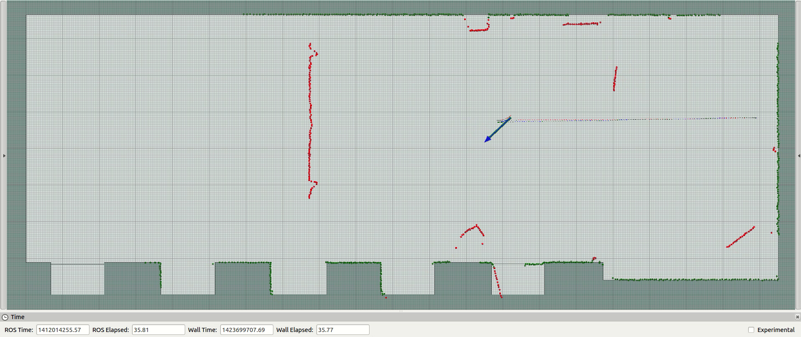
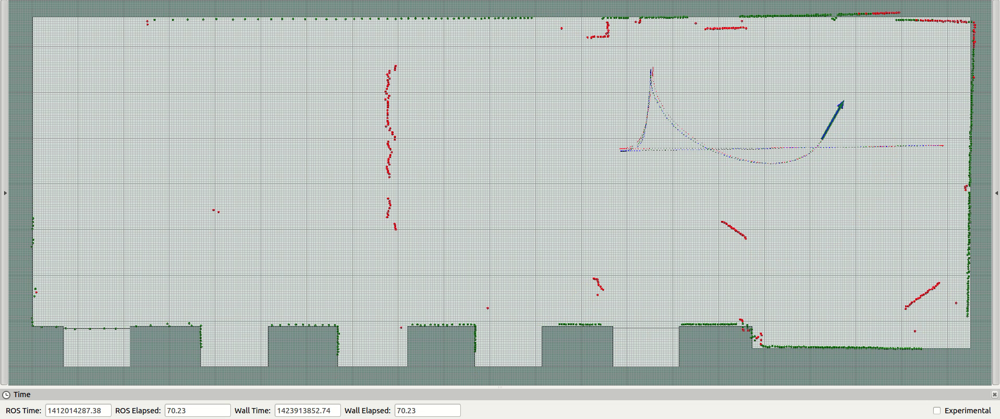
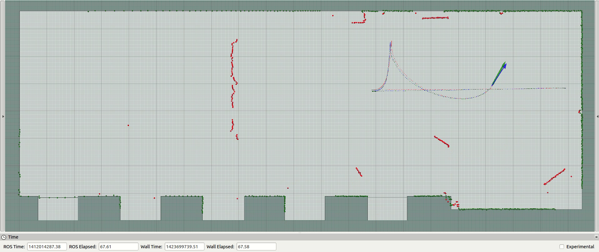

laserscan\_to\_pointcloud
=======================

ROS package able to assemble [sensor_msgs::LaserScan](http://docs.ros.org/api/sensor_msgs/html/msg/LaserScan.html) and publish [sensor_msgs::PointCloud2](http://docs.ros.org/api/sensor_msgs/html/msg/PointCloud2.html) using spherical linear interpolation (interpolation optional and number of TFs to use customizable).

It can publish point clouds after a given number of laser scans has been assemble or at regular intervals (these parameters can be changed dynamically through dynamic\_reconfigure or by analyzing [nav_msgs::Odometry](http://docs.ros.org/api/nav_msgs/html/msg/Odometry.html) | [sensor_msgs::Imu](http://docs.ros.org/api/sensor_msgs/html/msg/Imu.html) | [geometry_msgs::Twist](http://docs.ros.org/api/geometry_msgs/html/msg/Twist.html)).

Its main use cases are:
- Correct distortion of sensor_msgs::LaserScan
- Merge laser scans from several sensors into a single point cloud
- Merge laser scans from a laser scan that is mounted in a tilting platform

The lasers are transformed and merged into a given TF frame and the assembler can use an auxiliary frame as recovery (allows to assemble frames in the map frame and when this frame becomes unavailable, it uses the laser->odom TF and the last odom->map TF).

To perform spherical linear interpolation it is necessary to estimate the sensor movement within the time of the first and last laser scan (using TF transforms). This can be achieved with a target frame\_id that includes motion estimation within the TF chain or with a separate TF chain using the motion\_estimation\_source\_frame\_id and motion\_estimation\_target\_frame\_id parameters.

For more information about the package configurations, please see the documentation available in [laserscan_to_pointcloud.launch](launch/laserscan_to_pointcloud_assembler.launch).


```
Figure 1.1: Example 1 of laser deformation
```




```
Figure 1.2: Example 1 of laser deformation corrected using spherical linear interpolation
```




```
Figure 2.1: Example 2 of laser deformation
```




```
Figure 2.2: Example 2 of laser deformation corrected using spherical linear interpolation
```
